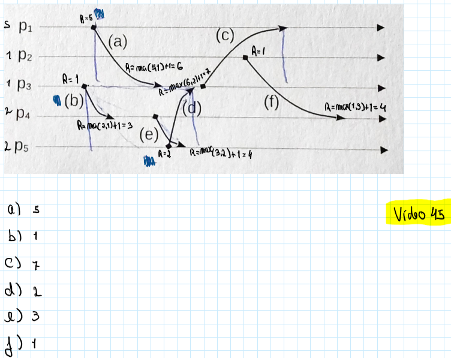

# Teste 2024 - Grupo I

## 1

No Algoritmo da Padaria de Lamport, cada processo escolhe um número. Se dois processos escolherem o mesmo número, o processo com o menor ID entra primeiro na SC. Um processo pode entrar na seção crítica se tiver o menor número entre todos os processos que desejam entrar na seção crítica. O algoritmo garante que um processo que pretende entrar na seção crítica eventualmente poderá fazê-lo. Este impede que qualquer processo seja ultrapassado mais de uma vez por outro processo. Isto é feito garantindo que os números sejam atribuídos de maneira que reflitam a ordem dos pedidos.

## 2

(tudo mal)

## 3

Na disseminação epidémica, cada nó na rede seleciona periodicamente alguns nós aleatórios e troca informações com eles. Desta forma é possível espalhar informação rápidamente por todos os nós. O facto de os nós serem escolhidos aleatóriamente torna este métido resiliente a falhas em outros nós. A Chord DHT utiliza hashing consistente para distribuir chaves uniformemente entre os nós. Cada nó mantém informações sobre um pequeno subconjunto de outros nós. O uso de hashing consistente garante que cada nó só precise conhecer um número logarítmico de outros nós. Isso permite que o sistema gerencie um grande número de participantes de maneira eficiente.A estrutura do Chord permite que o sistema roteie eficientemente em torno de nós com falhas, mantendo a robustez e a confiabilidade. Ambas as abordagens minimizam a necessidade de conhecimento global e controlo centralizado, distribuindo tarefas de forma que escalam logaritmicamente com o número de participantes. Essa descentralização é crucial para a capacidade deles de lidar com um número muito grande de participantes.

## 4

No caso de os sistemas se encontarem no mesmo centro de dados, podemos recorrer ao **two-phase commit**. Desta forma a reserva só será feita na totalidade se tanto a reserva na transportadora como a reserva no hotel sejam feitas com sucesso. No caso de os sistemas se encontrarem em centros de dados diferentes, ao utilizar o 2PC, irá aumentar a latência devido à distância entre os servidores. Existe ainda o risco de ocorrer um timout do processo coordenador.
